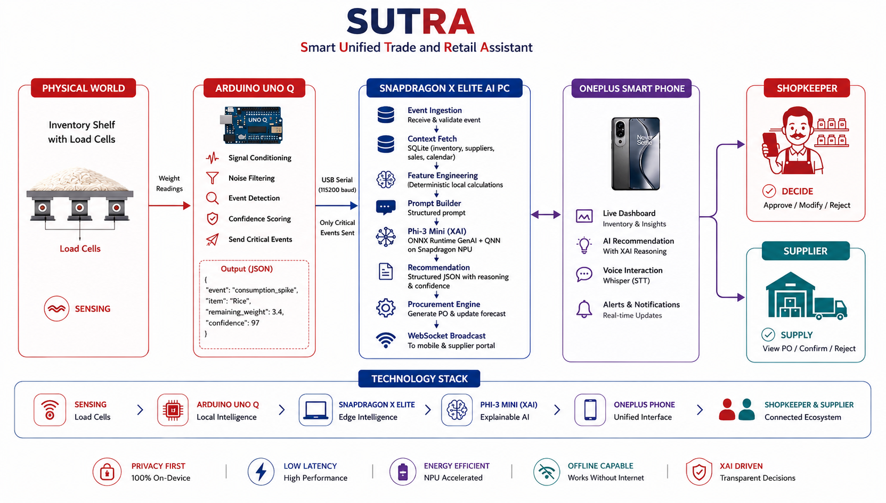

# SUTRA

### **Smarter Unified Trade & Retail Assistant**

### *Where Edge AI Meets Explainable Retail Intelligence.*

<br>


<p align="center">
  
</p>

---

# 🚀 Project Overview

SUTRA is an edge-native AI companion for intelligent inventory management, combining real-time sensor data, deterministic business analytics, and Microsoft Phi-3 to deliver explainable procurement decisions entirely on-device.

Built for seamless multi-device deployment—from Arduino UNO Q powered smart shelves and Qualcomm Snapdragon X Elite AI PCs to mobile devices—SUTRA enables autonomous inventory monitoring, intelligent procurement recommendations, and explainable business reasoning while preserving user privacy through completely local AI inference.

---

# 🏗 System Architecture

<p align="center">
  
</p>

---

# ✨ Key Features

| Feature | Description |
|----------|-------------|
| 🧠 Edge AI | Microsoft Phi-3 runs locally on Snapdragon X Elite NPU |
| 📦 Smart Inventory | Real-time inventory monitoring using Load Cells |
| ⚡ Event Driven | AI activates only for meaningful inventory events |
| 🛡 Explainable AI | Every recommendation includes transparent reasoning |
| 📱 Multi-Device | Arduino UNO Q + AI PC + Mobile + Supplier Portal |
| 🔒 Privacy First | No cloud inference required |
| ⚙️ Deterministic Analytics | Business calculations performed before AI reasoning |
| 🚀 Snapdragon Optimized | ONNX Runtime GenAI + Qualcomm QNN Execution Provider |

---

# 🧩 Module Overview

| Module | Runs On | Input | Output | Responsibility |
|----------|----------|----------|-----------|----------------|
| Load Cell + HX711 | Smart Shelf | Inventory Weight | Analog Signal | Continuous weight sensing |
| Arduino UNO Q | Edge Device | Analog Signal | Event JSON | Signal filtering, feature extraction & event detection |
| Backend | Snapdragon AI PC | Event JSON | Business Context | Inventory, supplier & sales aggregation |
| AI Engine | Snapdragon NPU | Business Context | Recommendation JSON | Explainable procurement intelligence |
| Mobile Dashboard | OnePlus Smartphone | Recommendation JSON | User Interaction | Inventory monitoring & approvals |
| Supplier Portal | Web Browser | Purchase Order | Confirmation | Procurement workflow |

---

# 📂 Repository Structure

```text
SUTRA/
│
├── arduino/
│   ├── firmware/
│   └── calibration/
│
├── backend/
│
├── frontend/
│
├── ml/
│   ├── llm/
│   ├── prompts/
│   ├── tests/
│   └── benchmarks/
│
├── models/
│
├── docs/
│
└── README.md
```

---

# 🔧 Hardware Requirements

| Hardware | Purpose |
|-----------|---------|
| Arduino UNO Q | Edge sensing & local event detection |
| HX711 Amplifier | Load Cell interface |
| Load Cell | Inventory weight sensing |
| Qualcomm Snapdragon X Elite AI PC | On-device AI inference |
| OnePlus Smartphone | Dashboard & approvals |
| USB-C Cable | Arduino communication |

---

# 🔌 Hardware Connections

## Load Cell → HX711

| Load Cell | HX711 |
|------------|--------|
| Red | E+ |
| Black | E− |
| White | A+ |
| Green | A- |

---

## HX711 → Arduino UNO Q

| HX711 | Arduino UNO Q |
|--------|---------------|
| VCC | 5V |
| GND | GND |
| DT | D2 |
| SCK | D3 |

---

<p align="center">
  
</p>

---

# 💻 Software Stack

| Layer | Technology |
|--------|------------|
| Firmware | Arduino Framework |
| Embedded Processing | Arduino UNO Q |
| Backend | Python |
| Database | SQLite |
| AI Model | Microsoft Phi-3 Mini |
| Runtime | ONNX Runtime GenAI |
| AI Accelerator | Qualcomm QNN Execution Provider |
| Hardware Accelerator | Snapdragon Hexagon NPU |
| Mobile Application | React Native |
| Supplier Portal | React |

---

# 🧠 AI Pipeline

```text
Inventory Event
        │
        ▼
Feature Engineering
        │
        ▼
Prompt Engineering
        │
        ▼
Microsoft Phi-3 Mini
        │
        ▼
Explainable Recommendation
        │
        ▼
Human Approval
```

---

# 📁 Important Files

| File | Responsibility |
|------|----------------|
| `agent.py` | Orchestrates the complete AI pipeline |
| `feature_engineering.py` | Generates deterministic business intelligence |
| `prompt_builder.py` | Builds structured prompts for Phi-3 |
| `parser.py` | Parses and validates AI responses |
| `conversation_memory.py` | Maintains conversational context |
| `explainer.py` | Produces explainable AI responses |
| `schemas.py` | Defines validated data contracts |
| `metrics.py` | Records inference performance |
| `config.py` | Global runtime configuration |
| `llm/factory.py` | Selects the active AI backend |
| `llm/qualcomm_phi3.py` | Executes Phi-3 using ONNX Runtime GenAI on Qualcomm QNN |

---

# ⚙️ Installation

## Clone Repository

```bash
git clone https://github.com/<username>/SUTRA.git

cd SUTRA
```

---

## Create Virtual Environment

```bash
python -m venv .venv

source .venv/bin/activate
```

Windows

```powershell
.venv\Scripts\activate
```

---

## Install Dependencies

```bash
pip install -r ml/requirements.txt
```

---

## Download Phi-3 ONNX Model

Place the ONNX Runtime GenAI model inside

```text
models/
└── phi3-onnx/
```

---

## Flash Arduino Firmware

Upload the firmware located in

```text
arduino/firmware/
```

using Arduino IDE.

---

## Run Backend

```bash
python backend/main.py
```

---

## Run AI Engine

```bash
python -m ml.agent
```

---

## Run Frontend

```bash
npm install

npm start
```

---

# ▶️ Demo Workflow

1. Place inventory on the smart shelf.
2. Load Cell continuously measures weight.
3. Arduino UNO Q filters noise and detects meaningful events.
4. Critical events are transmitted to the Snapdragon AI PC.
5. Business context is retrieved locally.
6. Microsoft Phi-3 generates an explainable procurement recommendation.
7. Recommendation is displayed on the mobile dashboard.
8. Shopkeeper approves or modifies the purchase order.
9. Supplier receives the procurement request instantly.

---

# 🚀 Future Scope

- 📷 Camera-based inventory sensing for visual stock verification
- 🌍 Regional demand intelligence using Cloud-based analytics
- 🔐 Tamper detection through anomaly-aware sensor event classification
- 📈 Predictive inventory forecasting using historical business trends
- 🏪 Multi-store inventory optimization and supplier coordination

---

# 👥 Contributors

Team SUTRA

Built for the **Qualcomm Snapdragon X Elite Hackathon**.

---

## License

MIT License
